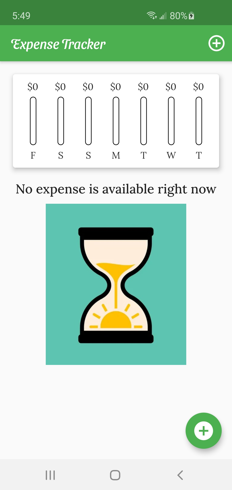
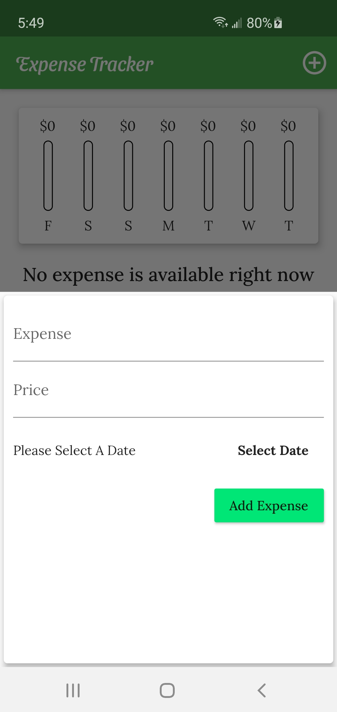
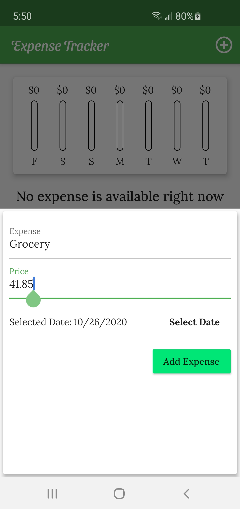
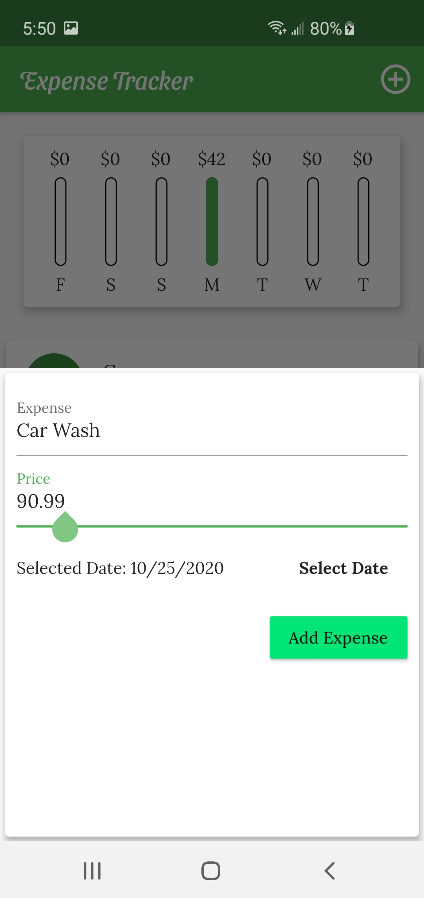
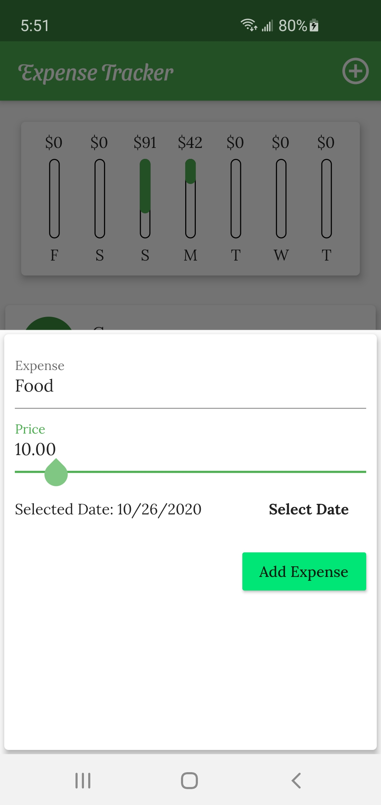
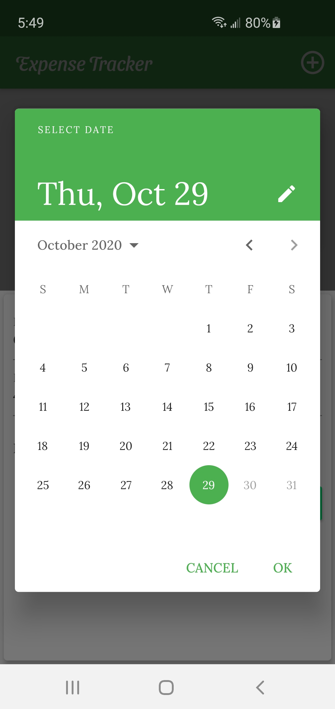
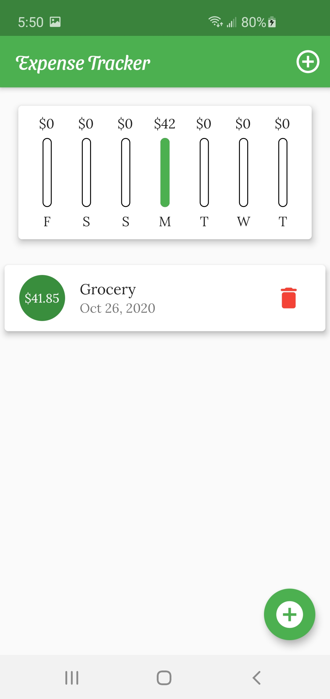
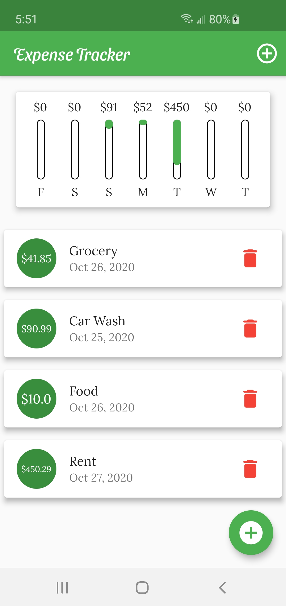
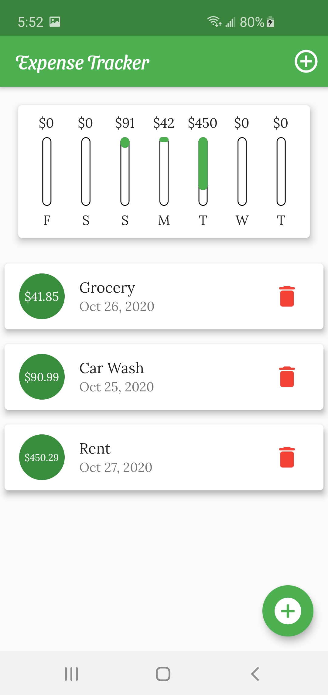
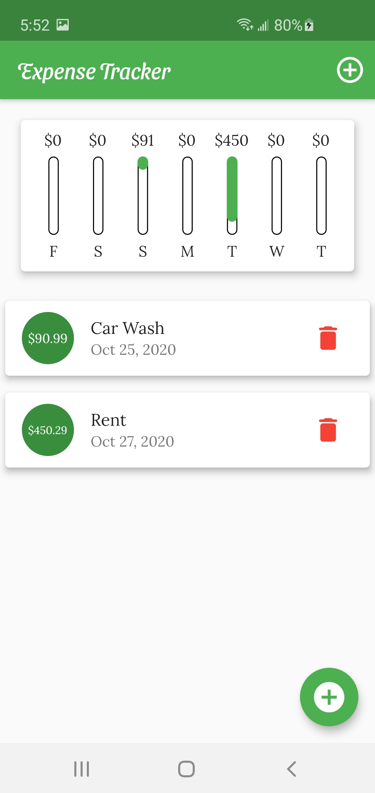

# Expense Tracker

"Expense Tracker" is a flutter project which is mainly designed for both an Android and an iOS device to save the expense of an individual on a daily basis. It includes various widgets like ListView, Bar-Charts, Expanded, Flat & Raised Button, Date Picker, etc. from Flutter to give user a better UI control all over the application with the help of designing concepts of Material UI.

Technology Used:
  1. Dart (Flutter)
  2. Material UI
  
Prefered Tool: Microsoft Visual Studio Code

Application Screenshots:

Home Screen

To add a new expense

Date picker to select a date

After expense is added

After deleting an expense

